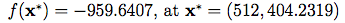
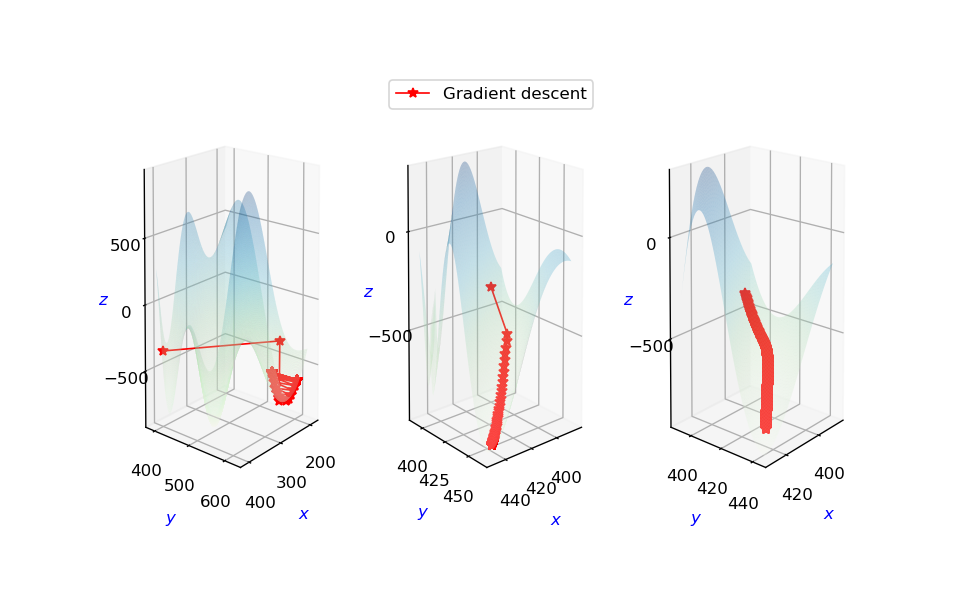
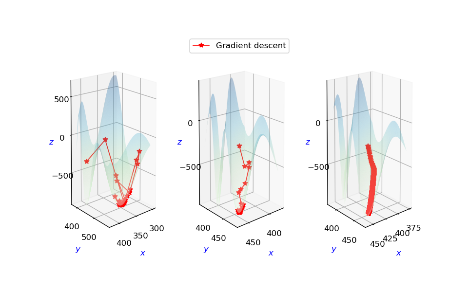
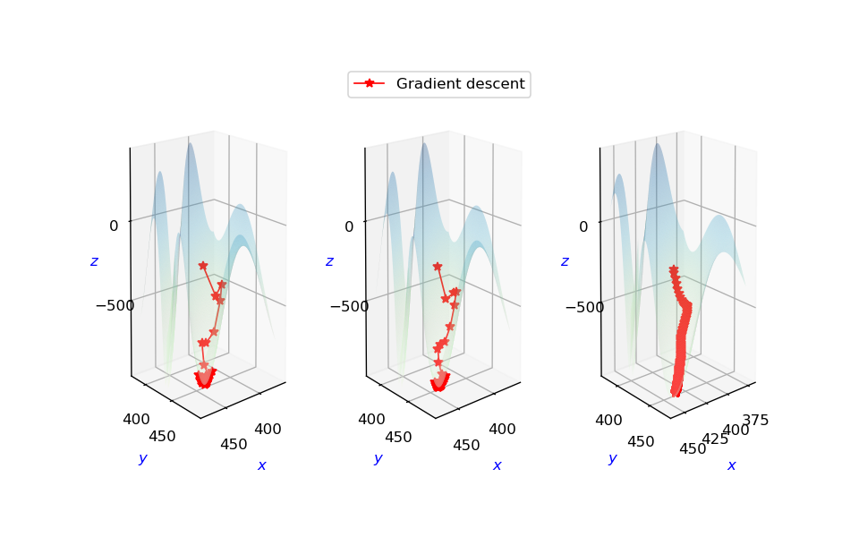
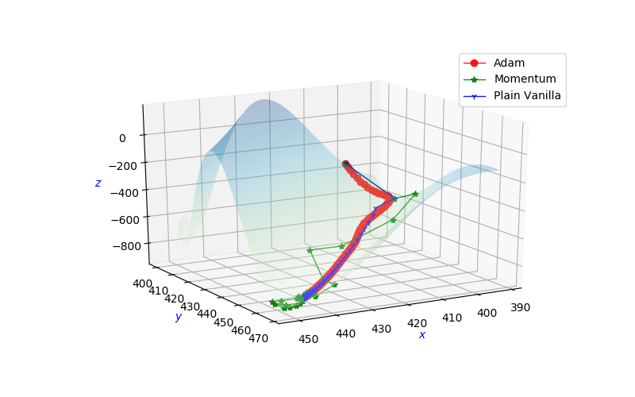
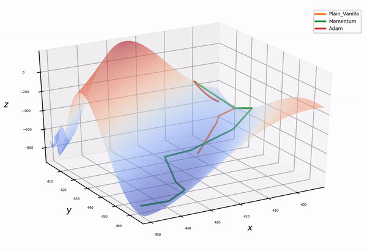

# AML_2019 Coursework, Part 1, Group 3
Gradient Descent for SMM284 An Introduction to Machine Learning 

# 1. Egg Holder Function

    

    

For our Gradient Descent Project, we have decided to choose the **Egg Holder Function** to see how different gradient Descent works.

### The Global Minimum for Egg Holder Function is as followed

    

Reference: [Egg Holder Function Reference](https://www.sfu.ca/~ssurjano/egg.html)

# 2. Introduction

This project is designed to experiment 3 different methods (Plain Vanilla, Momentum, Adam) on a two variables gradient descent function - Eggholder which has the large number of multiple local minimas. It applies 3 different learning rates on each model to achieve the best performance result. Then, it provides a comparison table and an annimation gif to illustrate the best model and its result for the Eggholder function based on the same parameters setting among the 3 gradient descent approaches. 

The following variant of gradient descent have been used in our project.

## 2.1 Plain Vanilla
Plain vanilla gradient descent that attempts to find the global minima by descending down each gradient.
Note the learning rate, small learning rates means reaching the minima by small steps which can take longer time, 
while a large learning rate (step size) could cause us to miss the minima and bounce around.

 

**Large Learning Rate (Left plot)** 
Due to the large step size, the path taken bounced around and missed the true minimum. It seems needs more steps to locate the local minimum.

**Medium Learning Rate (Centre plot)** 
Here there was quite a smooth descend into the minimum. Achieving a minimised loss function of -935.34 after 231 steps

**Small Learning Rate (Right plot)** 
It achieves closer point at -860.87, however at a significantly slower pace with 999 iterations instead. This is due to the smaller step size. If we limited the iterations to 100, the algorithm would have stopped prematurely.

**Plain Vanilla Experiment Result Table** 

 No.|Eta| Converged Steps | Achieved Coordinates | Loss fn
------------ | ------------ | ----------- |------------- | -------------
1|6.5 | 999 | (200.89, 536.18) |-624.78
2|0.3 | 231| (439.48, 453.98) |-935.34 
3|0.005 | 999| (419.41, 434.65) |-860.87

## 2.2 Momentum 

Momentum (1964) make use of the moving averages of the gradient instead of just taking one value like in plain vanilla gradient descent. It can accumulate velocity in the direction where the gradient is pointing towards the same direction across iterations. It achieves this by adding a portion of the previous weight update to the current one.[Reference](https://medium.com/@hengluchang/visualizing-gradient-descent-with-momentum-in-python-7ef904c8a847)

 

We first initialize our weights at **(400.1,400.1)** in the ravine loss surface (*Egg holder Function*). 

Then, we experiment with different learning rate **eta1(6.5), eta2(0.3),and eta3(0.005)** for 1000 iterations and see how it reach to the global minimum **f(x)=-959.64, at x = (512, 404.23)**. 

Compares to Plain Vanilla approach *(231 steps)*, it takes **114 less steps** to reach the global minima with **117 steps** under same learning rate **eta2 (0.3)**. This is due to momentum term increases for dimensions whose gradients point in the same directions and reduces updates for dimensions whose gradients change directions. As a result, it gains faster convergence and reduced oscillation. [Reference](http://ruder.io/optimizing-gradient-descent/index.html#momentum) 

Besides, if the stepsize set to be too large (eta1), although the gradient descend converges the earliest, it cannot reach to a minimum as low as the others. This is because large step size can pass over the true minimum and bounce back to higher point (-888.95). Similarly, if the step size too small (eta3), it requests the same number of step size as PV approach to achieve the global minima (-955.25) which results in a higher computational cost.

**Momentum Experiment Result Table** 

 No.|Eta| Converged Steps | Achieved Coordinates | Loss fn
------------ | ------------ | ----------- |------------- | -------------
1|1.5 | 115 | (347.33, 499.42) |-888.95
2|0.3 | 117| (439.48, 453.98) |-935.34
3|0.005 | 999| (439.1, 453.98) |-935.31

**Large Learning Rate (Left plot)** 
The path reaches to the converged point at the earliest as the large step size, however, it does not reach to the local minimum as the path taken bounced around and missed the true minimum.

**Medium Learning Rate (Centre plot)**  
Here there was quite a smooth descend into the minimum. Achieving a minimised loss function of -935.34 after 117 steps.

**Small Learning Rate (Right plot)**  
It achieves same local minimum point at -935.34, however at a significantly slower pace with 999 iterations instead. This is due to the smaller step size. If we limited the iterations to 100, the algorithm would have stopped prematurely.

## 2.3 Adam 

Adaptive Moment Estimation (Adam) multiply a positive factor to the learning rate and moving averages of the gradient. In addition to storing an exponentially decaying average of past squared gradients vt, Adam also keeps an exponentially decaying average of past gradients mt similar to momentum. Whereas momentum can be seen as a ball running down a slope, Adam behaves like a heavy ball with friction, which thus prefers flat minima in the error surface We compute the decaying averages of past mt and past vt squared gradients. mt and vt are estimates of the first moment (the mean) and the second moment (the uncentered variance) of the gradients respectively, hence the name of the method. 

 

Based on results of our experiments, the Adam approach has much higher computational cost compare to Momentum. With the same learning rate eta1(6.5) eta2(0.3） eta3（0.005) and same initialised weights at (400.1,400.1), it takes 1894 steps to reach the same global minima(-935.33) whereas momentum only takes 117 steps. This might due to the complication of the Egg holder surface contains multi-minima bottom points.

**Adam Experiment Result Table** 

 No.|Eta| Converged Steps | Achieved Coordinates | Loss fn
------------ | ------------ | ----------- |------------- | -------------
1|10.5 | 216 | (439.48, 453.98) |-935.34
2|6.5 | 236| (439.48, 453.98)  |-935.34
3|0.5 | 773| (439.48, 453.98)  |-935.34

**Large Learning Rate (Left plot)** 
The path reaches to the local minima point -935.34 at the earliest (216 steps) based on the large step size.

**Medium Learning Rate (Centre plot)**  
The path reaches to the same local minima point -935.34 with slightly slower pace (236 steps) compare to large step size.

**Small Learning Rate (Right plot)**  
It turns out that smaller step size causes significantly longer path to reach the local minima -935.34 with 773 steps.

# 3. Conclusion

To conclude our experiment with gradient descent, we put Adam, Momentum and Plain Vanilla together and observe the performance. The result are recorded in the table and graph below.

 
 

**Experiment Result Comparison Table** 

 Type of GD|Eta| Converged Steps | Achieved Coordinates | Loss fn
------------ | ------------ | ----------- |------------- | -------------
Adam|0.3 |499 | (437.99, 452.51)  |-934.91
Momentum|0.3 |117| (439.48, 453.98)   |-935.34
Plain Vanilla|0.3| 231| (439.48, 453.98)  |-935.34

When we tried to plot 3 approaches (PV, Momentu, Adam) together with same learning rate 0.3 and initial point (400.1,400.1), we can conclude that Momentum has the best performance among other 2 methods. Momentum converged in 117 steps to reach the local minimum -935.33 whereas Adam preforms worse than PV which has the highest computational cost.

 
 
